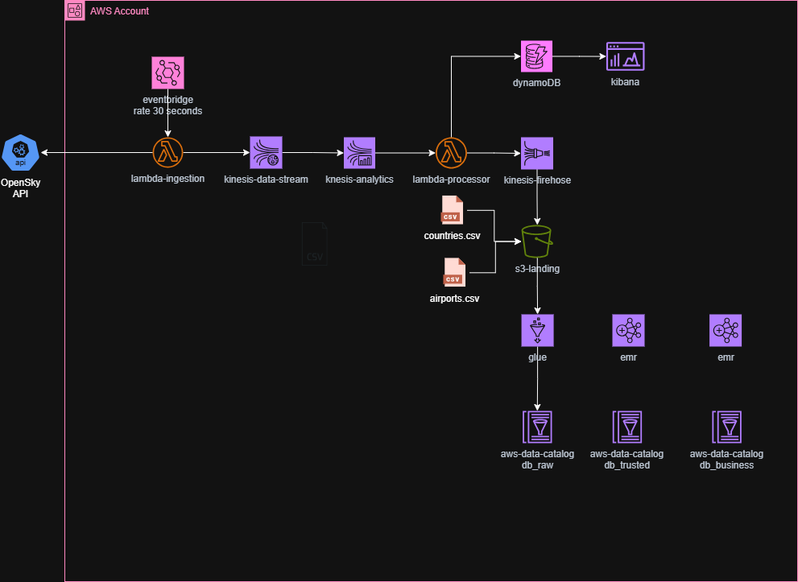

# AWS Streaming Flight Radar

Pipeline de ingestão e processamento em tempo real de dados de voos (OpenSky API) usando serviços gerenciados da AWS.

## Arquitetura



**Fluxo principal:**

1. **EventBridge** agenda a execução periódica das Lambdas de ingestão
2. **Lambda Ingest (`ingest-flights`)**
   - Lê credenciais da OpenSky via **AWS Secrets Manager**
   - Chama a **OpenSky API**
   - Publica eventos no **Kinesis Data Streams**
3. **Kinesis Data Streams**
   - Recebe eventos de voo em modo **ON_DEMAND**
   - Entrega para consumidores downstream
4. **Lambda Processor** (futuro/expansível)
   - Lê do Kinesis
   - Processa/enriquece dados
   - Persiste em **DynamoDB**
5. **CloudWatch & IAM**
   - Logs e métricas das Lambdas, Kinesis e Secrets Manager
   - Alarmes e monitoramento
   - Controle de acesso via IAM (least privilege)

## Principais Componentes

- `infra/`
  - Terraform para provisionar:
    - AWS Secrets Manager (credenciais OpenSky)
    - Lambda de ingestão
    - Kinesis Data Stream
    - Regras EventBridge (agendamento)
    - CloudWatch Logs / Alarms
    - IAM Roles & Policies
- `app/`
  - Código Python da Lambda de ingestão (`ingest_flights`):
    - Recupera credenciais do Secrets Manager
    - Chama OpenSky
    - Envia registros ao Kinesis

## Como Deployar (resumo)

1. Criar `.env` a partir do template:

   ```bash
   cp .env.example .env
   nano .env   # Preencher OPENSKY_USERNAME, OPENSKY_PASSWORD, AWS_REGION
   ```

2. Configurar credenciais AWS (via `aws configure` ou variáveis de ambiente).

3. Executar o setup + deploy (Linux/macOS):

   ```bash
   chmod +x setup-env.sh
   ./setup-env.sh --apply
   ```

   Ou no Windows (PowerShell):

   ```powershell
   .\setup-env.ps1 -Action apply -AutoApprove
   ```

## Verificação Rápida

```bash
# Secret criado
aws secretsmanager get-secret-value \
  --secret-id flight-radar-stream-opensky-credentials

# Lambda criada
aws lambda list-functions | grep flight-radar-stream-ingest-flights

# Stream Kinesis
aws kinesis describe-stream \
  --stream-name flight-radar-stream-flights

# Logs da Lambda
aws logs tail /aws/lambda/flight-radar-stream-ingest-flights --follow
```

## Segurança

- Credenciais **não** são commitadas (uso de `.env` e `.gitignore`)
- Armazenamento seguro em **AWS Secrets Manager** (KMS, audit logs)
- IAM com princípio de **least privilege**
- Arquitetura pronta para rotacionar credenciais e escalar múltiplas Lambdas

---
Documentação detalhada em:

- `SETUP_AND_DEPLOY.md`
- `LAMBDA_CONFIGURATION_GUIDE.md`
- `KINESIS_LAMBDA_INTEGRATION.md`
- `SECRETS_MANAGER_SETUP.md`
- `DEPLOYMENT_CHECKLIST.md`